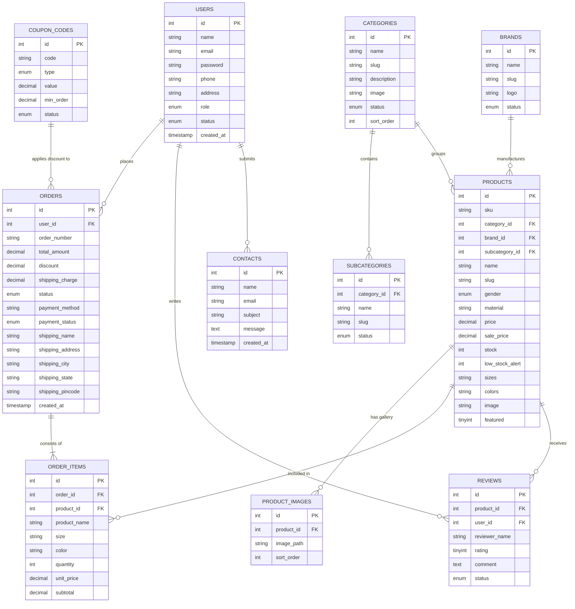

# PROJECT REPORT / PROGRESS BOOK
## E-Commerce Website For Clothing & Fashion (Gujju Clothing)

---

### **PAGE 1: TITLE PAGE**

```
================================================================================
                              TITLE PAGE
================================================================================

                         A Project Report On
          "E-Commerce Website For Clothing & Fashion"
                       (Gujju Clothing)

               Kamani Science & Prataprai Arts College

Developed By:
  1. [Student Name 1]          (En. No: 24150021410XXXX)
  2. [Student Name 2]          (En. No: 24150021410YYYY)

Under the Guidance of:
  Prof. Rekha Madam Kanak
  Department of Computer Science / Applications

Year of Submission:
  Submitted in Academic Year: 2026 - 2027

                      Saurashtra University
                             Rajkot
================================================================================
```

---

### **PAGE 2: INTRODUCTION OF PROJECT**

### **Introduction of Project**
**Gujju Clothing** is a full-featured, responsive, and database-driven e-Commerce web application designed to showcase and sell premium apparel, ethnic wear, western outfits, and fashion accessories. The platform provides customers with an elegant, secure, and user-friendly online shopping destination to explore diverse clothing categories, filter by size, color, brand, and gender, view high-resolution image galleries, apply discount coupons, and complete purchases smoothly.

The website focuses on delivering a modern, high-performance retail experience through:
- **Intuitive User Interface**: High aesthetic appeal with seamless navigation across Men’s, Women’s, and Kids’ collections.
- **Advanced Product Catalog**: Multi-attribute filtering (Brand, Category, Subcategory, Gender, Price Range, Size, Color) with instant search auto-suggestions.
- **Secure Authentication & Account Hub**: Customer login, registration, password recovery, profile management, and live order tracking.
- **Integrated Shopping Cart & Billing Engine**: Interactive cart management, coupon code discounts, automated tax and shipping calculations, and instant printable invoice generation.
- **Comprehensive Admin Panel**: Centralized management for products (with multi-image upload & SKU tracking), inventory & low-stock alerts, brand & category management, order fulfillment lifecycle, customer reviews moderation, and financial billing reports.

---

### **PAGE 3: SYSTEM ANALYSIS & OBJECTIVES**

### **1. System Analysis**
System Analysis is the process of studying user requirements, examining existing business workflows, and designing an information system that fulfills those requirements efficiently and reliably.

The **Gujju Clothing E-Commerce Website** was analyzed to address the distinct needs of two primary user groups:
1. **Customers (Shoppers)**: Require a fast, responsive, and visually engaging platform to discover apparel, verify size/fit information, inspect fabric details, add items to cart/wishlist, apply promo coupons, and place orders with real-time tracking.
2. **Administrators (Store Owners)**: Require an organized, secure back-office dashboard to manage product catalogs, monitor inventory levels (with low-stock notifications), process customer orders, issue formal invoices, manage promotional campaigns, and oversee customer inquiries.

The proposed system significantly improves user experience by delivering rapid page loads, mobile responsiveness, secure Bcrypt credential encryption, structured relational data handling, and automated billing workflows.

---

### **2. Objective of Project**
The primary objectives of the **Gujju Clothing** project are:
- **To Provide a 24/7 Digital Storefront**: Enable customers to browse and purchase clothing anytime, anywhere without physical store constraints.
- **To Showcase Rich Product Information**: Display comprehensive apparel catalogs with multiple gallery images, size charts, material descriptions, color swatches, and customer ratings.
- **To Offer Robust User Authentication**: Implement secure user registration, session management, and encrypted password protection.
- **To Streamline the Shopping & Checkout Workflow**: Deliver an interactive cart, dynamic discount coupon application, and flexible payment options (Cash on Delivery & Online simulation).
- **To Provide Automated Billing & Invoicing**: Generate formal, printable PDF/HTML order invoices with detailed tax, discount, and line-item breakdowns.
- **To Enable Centralized Admin Management**: Empower store managers with full control over products, categories, subcategories, brands, stock alerts, orders, and customer feedback.
- **To Ensure Multi-Device Compatibility**: Provide a mobile-first, fully responsive design optimized for smartphones, tablets, laptops, and desktop screens.

---

### **PAGE 4: PROBLEM DEFINITION & REQUIREMENT GATHERING**

### **3. Problem Definition**
Traditional brick-and-mortar clothing stores and manual retail operations face several significant limitations:
- **Restricted Operating Hours & Geographic Reach**: Physical stores are limited to specific hours and local foot traffic, restricting customer access and business growth.
- **Difficult Inventory & Size Comparison**: Customers often struggle to check real-time size availability, compare prices, or view matching accessories across physical racks.
- **Manual Billing & Record Keeping**: Paper receipts and disconnected spreadsheets lead to billing errors, slow order processing, and poor customer purchase records.
- **Lack of Real-Time Tracking**: Customers have no immediate visibility into order dispatch, shipping status, or delivery timelines.

**The Solution**:
**Gujju Clothing** solves these challenges by providing a 24/7 accessible web platform. Customers can explore thousands of fashion styles, check live stock, apply instant promo discounts, place orders securely, download printable invoices, and monitor their order fulfillment in real-time.

---

### **4. Requirement Gathering**

#### **A. Functional Requirements**
- **User Authentication**: Secure Sign-up, Login, Logout, Forgot Password, and Profile Updates.
- **Catalog & Discovery**: Category, Subcategory, and Brand browsing; Gender-based filtering (Men, Women, Kids, Unisex); Dynamic search with live suggestion dropdown.
- **Product Details**: Multi-angle image gallery, SKU code, size selector, color options, material details, and size guide modal.
- **Cart & Wishlist**: Real-time AJAX item quantity updates, subtotal calculations, and wishlist bookmarking.
- **Discounts & Coupons**: Promo code validation (Percentage or Fixed discounts with minimum order rules).
- **Checkout & Orders**: Multi-field shipping address capture, order placement, order confirmation email/screen, and order history tracking.
- **Billing & Invoice Module**: Automated generation of printable, itemized order invoices (`admin/invoice.php`).
- **Admin Control Suite**: Full CRUD operations for Products, Categories, Brands, Orders (status updates: Pending -> Processing -> Shipped -> Delivered), Reviews, Coupons, and Admin Password Reset.

#### **B. Non-Functional Requirements**
- **User-Friendly Interface**: Clean, modern typography and intuitive navigation.
- **Responsive Web Design**: Fluid layout adapting seamlessly to mobile, tablet, and desktop viewports.
- **Performance & Speed**: Optimized MySQL queries, lightweight CSS, and efficient page loading.
- **Data Security**: Secure session handling, SQL injection prevention via Prepared Statements (PDO), XSS protection via HTML sanitization, and Bcrypt password hashing.
- **Reliability & Availability**: Scalable database schema with relational integrity and foreign key constraints.

#### **C. Software Requirements**
- **Operating System**: Windows 10 / Windows 11 / Linux / macOS
- **Web Server**: Apache 2.4+ (via XAMPP)
- **Server-Side Scripting**: PHP 8.0+
- **Database Engine**: MySQL 8.0+ / MariaDB (managed via phpMyAdmin)
- **Frontend Technologies**: HTML5, CSS3, JavaScript (ES6+), FontAwesome Icons
- **Development Tools**: Visual Studio Code, Git, Modern Web Browsers (Chrome, Edge, Firefox)

---

### **PAGE 5: HARDWARE REQUIREMENTS & SDLC 6 STEPS**

### **Hardware Requirements**
- **Processor**: Intel Core i3 / AMD Ryzen 3 or higher (Multi-core recommended)
- **RAM**: Minimum 4 GB (8 GB or higher recommended)
- **Storage**: Minimum 20 GB free disk space (SSD recommended)
- **Display Resolution**: 1366 x 768 minimum (1920 x 1080 Full HD recommended)
- **Network**: Active Broadband / Localhost Internet Connection

---

### **SDLC (Software Development Life Cycle) — 6 Steps**

```
+-------------------------------------------------------------------------------+
|                      SDLC 6-PHASE METHODOLOGY                                 |
+-------------------------------------------------------------------------------+
|  1. Requirement Gathering & Analysis                                          |
|     -> Defined business goals, user personas, catalog structure & workflows.  |
+-------------------------------------------------------------------------------+
|  2. System Design & Architecture                                              |
|     -> Designed ER diagrams, DFDs, database schema, and UI/UX wireframes.    |
+-------------------------------------------------------------------------------+
|  3. Development & Implementation                                              |
|     -> Built PHP backend, MySQL relational tables, and responsive CSS/JS UI.  |
+-------------------------------------------------------------------------------+
|  4. Testing & Quality Assurance                                               |
|     -> Performed functional testing, authentication checks & edge-case tests. |
+-------------------------------------------------------------------------------+
|  5. Deployment & Configuration                                                |
|     -> Configured on local XAMPP Apache/MySQL stack & live hosting ready.     |
+-------------------------------------------------------------------------------+
|  6. Maintenance & Support                                                    |
|     -> Ongoing catalog updates, performance tuning, and security patches.     |
+-------------------------------------------------------------------------------+
```

---

### **PAGE 6: QUESTIONS (Q1 TO Q11)**

**Q=1) What is the Name of Your Project?**
> **->** *E-Commerce Website For Clothing & Fashion (Gujju Clothing)*

**Q=2) Who Can Use this System Or Site?**
> **->** *Users (Customers) and Owner (Admin)*

**Q=3) Which Technology You Uses in it?**
> **->** *Front-end -> HTML, CSS, JS, FontAwesome*
> **->** *Back-end -> PHP, MySQL*

**Q=4) What is the reason to build that store?**
> **->** *Because many brands and apparel styles are active in market that you can buy any clothing fashion in one store.*

**Q=5) What Information will the System Share?**
> **->** *Clothing's specification, size guide charts, fabric material, and stock availability.*

**Q=6) How will Users register and log in?**
> **->** *In that user have email and authenticating it on their strong password (Bcrypt encryption).*

**Q=7) Which Payment methods will the System Support?**
> **->** *In that site have Cash On Delivery (COD) and Online / Card Payment simulation support.*

**Q=8) What is the return and Warranty Policy?**
> **->** *Any customer have 7 days return and exchange if clothing is damaged or not same as their order, and free shipping over ₹999.*

**Q=9) Can Users Save Items to a wishlist?**
> **->** *Yes.*

**Q=10) Will You show Stock availability?**
> **->** *Yes, in Admin Panel shows what apparel items are at low stocks.*

**Q=11) What Speciality in clothes at site?**
> **->** *All clothing have their detailed information, fabric specifications, and size chart guides.*

---

### **PAGE 7: QUESTIONS (Q12 TO Q15) & 4. PROFILE PAGE**

**Q=12) How Many clothing brands are in it?**
> **->** *8+ brands in site (Zara, H&M, Fabindia, Allen Solly, Levi's, W for Woman...)*

**Q=13) What types of clothing are in?**
> **->** *Men's, Women's, Kids', Ethnic Kurta Sets, Western Wear, Casual Shirts, Denim.*

**Q=14) Who is the target Audience?**
> **->** *Fashion enthusiasts, working professionals, students, and families.*

**Q=15) What will buy that site's widely or what is the price range?**
> **->** *Men's and Women's clothing are in and their price range from ₹499 to ₹5,000+.*

---

### **4. Profile Page**
The Profile Page is designed to manage and display the personal information and order-related details of the logged-in user. It provides a convenient interface for users to view their account information and track their orders.

#### **Key Features:**
- **User Information Management:** Displays the user's basic details, including Full Name, Email Address, and Phone Number.
- **Order History:** Provides a detailed table containing all previous orders with Order ID, Order Date, Total Amount, Payment Method, and current Order Status.
- **Order Status Tracking:** Allows users to track the real-time fulfillment status of their orders, such as Pending, Processing, Shipped, and Delivered.

---

### **PAGE 8: PROFILE PAGE (CONT.) & 5. HARDWARE AND SOFTWARE REQUIREMENT**

- **Session & Security Validation:** Ensures that only authenticated users can access the Profile Pages. If a user is not logged in, they are automatically redirected to the login page.

---

### **5. Hardware and Software Requirement**

#### *** Software Requirement:**
- **Operating System:** Windows 10 / Windows 11 / Linux / macOS
- **Web Server:** Apache 2.4+ (via XAMPP)
- **Server-side Scripting:** PHP 8.0+
- **Database Engine:** MySQL 8.0+ / phpMyAdmin
- **Frontend Technologies:** HTML5, CSS3, JavaScript (ES6+), Bootstrap 5.3, FontAwesome Icons
- **Development IDE:** Visual Studio Code
- **Web Browser:** Google Chrome / Mozilla Firefox / MS Edge

| Component | Technology / Environment | Version / Role |
| :--- | :--- | :--- |
| **Operating System** | Windows 10 / 11 / Linux / macOS | Development & Host Environment |
| **Web Server** | Apache HTTP Server | Version 2.4+ (via XAMPP) |
| **Backend Language** | PHP (Hypertext Preprocessor) | PHP 8.0+ (PDO Extension) |
| **Database Engine** | MySQL / MariaDB | Version 8.0+ / phpMyAdmin |
| **Frontend Tech** | HTML5, CSS3, JavaScript | ES6+ & FontAwesome 6.5 |
| **Code Editor** | Visual Studio Code | Source Code Development |

---

### **PAGE 9: HARDWARE REQUIREMENTS & 6. PROJECT STRUCTURE DIAGRAM**

#### *** Hardware Requirements:**
- **Processor:** Intel Core i3 / AMD Ryzen 3 (8-core recommended)
- **RAM:** Minimum 4 GB (8 GB recommended)
- **Storage:** 20 GB free disk space (SSD recommended)
- **Display Resolution:** 1366 x 768 minimum
- **Network:** Active internet connection

| Hardware Resource | Minimum Requirement | Recommended Specification |
| :--- | :--- | :--- |
| **Processor (CPU)** | Intel Core i3 / AMD Ryzen 3 | Intel Core i5 / AMD Ryzen 5 or higher |
| **Memory (RAM)** | 4 GB RAM | 8 GB DDR4 or higher |
| **Storage** | 20 GB Free Space | 256 GB NVMe SSD |
| **Display Resolution** | 1366 x 768 pixels | 1920 x 1080 (Full HD) |
| **Network** | Localhost Connection | High-Speed Broadband Internet |

---

### **PAGE 9: PROJECT STRUCTURE DIAGRAM**

```
gujju_clothing (Root Directory: /i_test)
 │
 ├── config.php                  # Database credentials, site constants, & global settings
 ├── index.php                   # Homepage with hero slider, featured, & trending apparel
 ├── reset_admin.php             # Emergency secure admin password reset utility
 ├── .htaccess                   # URL rewriting, compression, and security rules
 │
 ├── /pages/                     # Public Storefront Pages
 │    ├── shop.php               # Catalog with category/brand/gender/price filters
 │    ├── product.php            # Detailed product page with gallery & size selector
 │    ├── account.php            # Customer account profile & address editor
 │    ├── orders.php             # Customer order history table
 │    ├── track-order.php        # Live order shipment tracking by Order ID
 │    ├── wishlist.php           # Saved favorite items list
 │    ├── quick_view.php         # Fast product preview popup modal
 │    ├── size-guide.php         # Interactive apparel measurement charts
 │    ├── contact.php            # Customer inquiry submission form
 │    ├── about.php              # Company brand story & mission statement
 │    ├── faq.php                # Frequently asked questions & answers
 │    ├── returns.php            # 7-day return & exchange guidelines
 │    ├── shipping.php           # Shipping rates and delivery time info
 │    ├── terms.php              # Terms and conditions of service
 │    └── privacy.php            # Data privacy & security policy
 │
 ├── /cart/                      # Cart, Checkout & Reviews
 │    ├── cart.php               # Shopping cart table with quantity modifiers
 │    ├── cart_actions.php       # AJAX backend for add/remove/update cart
 │    ├── checkout.php           # Multi-step checkout & payment selection
 │    ├── order-success.php      # Order confirmation & receipt summary
 │    └── submit_review.php      # Customer star rating & feedback handler
 │
 ├── /auth/                      # Authentication Module
 │    ├── login.php              # Customer login with Bcrypt verification
 │    ├── register.php           # New user sign-up form
 │    ├── forgot-password.php    # Password recovery workflow
 │    └── logout.php             # Session destruction & redirect
 │
 ├── /admin/                     # Admin Back-Office Module
 │    ├── index.php              # Admin Dashboard with live stats & revenue metrics
 │    ├── products.php           # Product inventory catalog table with search
 │    ├── product_form.php       # Add / Edit product with multi-image gallery upload
 │    ├── categories.php         # Category & subcategory manager
 │    ├── brands.php             # Clothing brand management
 │    ├── orders.php             # Order processing & status updater
 │    ├── invoice.php            # Printable commercial invoice generator
 │    ├── coupons.php            # Discount coupon code generator
 │    ├── reviews.php            # Customer review approval & moderation
 │    ├── users.php              # Registered user database management
 │    ├── /actions/              # Admin CRUD Action Handlers (add/edit/delete/bulk)
 │    └── /includes/             # Admin header & footer components
 │
 ├── /includes/                  # Shared Core Includes
 │    ├── db.php                 # PDO database connection & query wrappers
 │    ├── functions.php          # Global helper functions, auth guards, flash messages
 │    ├── header.php             # Global site navbar, search bar, & cart counter
 │    └── footer.php             # Global footer with navigation links & newsletter form
 │
 ├── /database/                  # Database Schema Files
 │    ├── schema.sql             # Primary database tables & seed records
 │    └── upgrade_products.sql   # Extended product attributes, brands, & gallery schema
 │
 ├── /assets/                    # Static Assets
 │    ├── /css/style.css         # Main application stylesheet
 │    ├── /js/script.js          # Main client-side interactivity & AJAX
 │    └── /images/               # UI graphics, logos, and banners
 │
 └── /uploads/products/          # Uploaded product photographs & galleries
```

---

### **PAGES 10, 11, 12: DATA DICTIONARY**

#### **1. `users` Table**
*Stores registered customer and administrator account credentials.*
| Field Name | Data Type | Key / Constraint | Description |
| :--- | :--- | :--- | :--- |
| `id` | INT(11) UNSIGNED | **PRIMARY KEY, AI** | Unique user identifier |
| `name` | VARCHAR(100) | NOT NULL | User's full name |
| `email` | VARCHAR(150) | **UNIQUE**, NOT NULL | Login email address |
| `password` | VARCHAR(255) | NOT NULL | Bcrypt encrypted password hash |
| `phone` | VARCHAR(20) | NULL | Contact phone number |
| `address` | TEXT | NULL | Default shipping street address |
| `role` | ENUM('customer','admin') | DEFAULT 'customer' | Access control level |
| `status` | ENUM('active','inactive')| DEFAULT 'active' | Account activation status |
| `created_at` | TIMESTAMP | CURRENT_TIMESTAMP | Registration timestamp |

---

#### **2. `categories` Table**
*Stores top-level clothing categories (e.g., Men, Women, Kids, Ethnic).*
| Field Name | Data Type | Key / Constraint | Description |
| :--- | :--- | :--- | :--- |
| `id` | INT(11) UNSIGNED | **PRIMARY KEY, AI** | Unique category identifier |
| `name` | VARCHAR(100) | NOT NULL | Category display title |
| `slug` | VARCHAR(110) | **UNIQUE**, NOT NULL | URL-friendly slug |
| `description` | TEXT | NULL | Category summary text |
| `image` | VARCHAR(255) | NULL | Category banner/thumbnail path |
| `status` | ENUM('active','inactive')| DEFAULT 'active' | Category visibility |
| `sort_order` | INT | DEFAULT 0 | Display priority sequence |

---

#### **3. `subcategories` Table**
*Stores secondary classifications (e.g., Shirts, Kurtas, Jeans, Dresses).*
| Field Name | Data Type | Key / Constraint | Description |
| :--- | :--- | :--- | :--- |
| `id` | INT(11) UNSIGNED | **PRIMARY KEY, AI** | Unique subcategory ID |
| `category_id` | INT(11) UNSIGNED | **FOREIGN KEY** | References `categories(id)` |
| `name` | VARCHAR(100) | NOT NULL | Subcategory title |
| `slug` | VARCHAR(110) | **UNIQUE**, NOT NULL | URL slug |
| `status` | ENUM('active','inactive')| DEFAULT 'active' | Active status |
| `sort_order` | INT | DEFAULT 0 | Display order |

---

#### **4. `brands` Table**
*Stores clothing brand/manufacturer information.*
| Field Name | Data Type | Key / Constraint | Description |
| :--- | :--- | :--- | :--- |
| `id` | INT(11) UNSIGNED | **PRIMARY KEY, AI** | Unique brand ID |
| `name` | VARCHAR(100) | NOT NULL | Brand name (e.g., Zara, H&M) |
| `slug` | VARCHAR(110) | **UNIQUE**, NOT NULL | URL slug |
| `logo` | VARCHAR(255) | NULL | Brand logo graphic URL |
| `status` | ENUM('active','inactive')| DEFAULT 'active' | Active/inactive flag |
| `sort_order` | INT | DEFAULT 0 | Ordering index |
| `created_at` | TIMESTAMP | CURRENT_TIMESTAMP | Brand creation time |

---

#### **5. `products` Table**
*Stores comprehensive apparel item details, pricing, and stock.*
| Field Name | Data Type | Key / Constraint | Description |
| :--- | :--- | :--- | :--- |
| `id` | INT(11) UNSIGNED | **PRIMARY KEY, AI** | Unique product ID |
| `sku` | VARCHAR(80) | **UNIQUE**, NULL | Stock Keeping Unit code |
| `category_id` | INT(11) UNSIGNED | **FOREIGN KEY** | References `categories(id)` |
| `brand_id` | INT(11) UNSIGNED | **FOREIGN KEY** | References `brands(id)` |
| `subcategory_id` | INT(11) UNSIGNED | **FOREIGN KEY** | References `subcategories(id)` |
| `name` | VARCHAR(200) | NOT NULL | Product name/title |
| `slug` | VARCHAR(220) | **UNIQUE**, NOT NULL | URL-safe slug |
| `gender` | ENUM('men','women','kids','unisex') | DEFAULT 'unisex' | Target gender |
| `material` | VARCHAR(200) | NULL | Fabric material (Cotton, Silk, Linen) |
| `description` | TEXT | NULL | Full product description |
| `price` | DECIMAL(10,2) | NOT NULL | Regular selling price (₹) |
| `sale_price` | DECIMAL(10,2) | DEFAULT 0.00 | Discounted price (₹) |
| `stock` | INT | DEFAULT 0 | Available inventory quantity |
| `low_stock_alert` | INT | DEFAULT 5 | Low stock warning threshold |
| `sizes` | VARCHAR(200) | DEFAULT 'XS,S,M,L,XL'| Comma-separated available sizes |
| `colors` | VARCHAR(200) | DEFAULT 'Black,White'| Comma-separated available colors |
| `image` | VARCHAR(255) | NULL | Primary product image URL |
| `featured` | TINYINT(1) | DEFAULT 0 | Homepage featured badge |
| `is_trending` | TINYINT(1) | DEFAULT 0 | Trending section flag |
| `is_new_arrival`| TINYINT(1) | DEFAULT 0 | New arrival section flag |
| `status` | ENUM('active','inactive')| DEFAULT 'active' | Product status |
| `created_at` | TIMESTAMP | CURRENT_TIMESTAMP | Product entry timestamp |

---

#### **6. `product_images` Table**
*Stores multi-angle photo gallery images for each clothing item.*
| Field Name | Data Type | Key / Constraint | Description |
| :--- | :--- | :--- | :--- |
| `id` | INT(11) UNSIGNED | **PRIMARY KEY, AI** | Unique image record ID |
| `product_id` | INT(11) UNSIGNED | **FOREIGN KEY** | References `products(id)` |
| `image_path` | VARCHAR(255) | NOT NULL | Uploaded image file path |
| `alt_text` | VARCHAR(200) | NULL | Image descriptive alt text |
| `sort_order` | INT | DEFAULT 0 | Photo display sequence |
| `created_at` | TIMESTAMP | CURRENT_TIMESTAMP | Upload timestamp |

---

#### **7. `orders` Table**
*Stores placed customer purchase orders and billing summaries.*
| Field Name | Data Type | Key / Constraint | Description |
| :--- | :--- | :--- | :--- |
| `id` | INT(11) UNSIGNED | **PRIMARY KEY, AI** | Unique order record ID |
| `user_id` | INT(11) UNSIGNED | **FOREIGN KEY** | References `users(id)` |
| `order_number` | VARCHAR(30) | **UNIQUE**, NOT NULL | Order reference code (e.g. ORD-2026-001) |
| `total_amount` | DECIMAL(10,2) | NOT NULL | Final invoice total (₹) |
| `discount` | DECIMAL(10,2) | DEFAULT 0.00 | Total coupon discount deducted |
| `shipping_charge`| DECIMAL(10,2)| DEFAULT 0.00 | Applied delivery fee |
| `status` | ENUM('pending','processing','shipped','delivered','cancelled') | DEFAULT 'pending' | Current order fulfillment status |
| `payment_method` | VARCHAR(50) | DEFAULT 'COD' | Payment mode (COD / Card / UPI) |
| `payment_status` | ENUM('pending','paid','failed') | DEFAULT 'pending' | Payment transaction status |
| `shipping_name` | VARCHAR(100) | NOT NULL | Recipient full name |
| `shipping_email`| VARCHAR(150) | NOT NULL | Recipient email address |
| `shipping_phone`| VARCHAR(20) | NOT NULL | Contact phone number |
| `shipping_address`| TEXT | NOT NULL | Delivery street address |
| `shipping_city` | VARCHAR(80) | NOT NULL | Delivery destination city |
| `shipping_state`| VARCHAR(80) | NOT NULL | Delivery destination state |
| `shipping_pincode`| VARCHAR(10)| NOT NULL | Area PIN / Postal code |
| `notes` | TEXT | NULL | Special delivery instructions |
| `created_at` | TIMESTAMP | CURRENT_TIMESTAMP | Order placement date/time |

---

#### **8. `order_items` Table**
*Stores line-item products included in each order.*
| Field Name | Data Type | Key / Constraint | Description |
| :--- | :--- | :--- | :--- |
| `id` | INT(11) UNSIGNED | **PRIMARY KEY, AI** | Unique order item ID |
| `order_id` | INT(11) UNSIGNED | **FOREIGN KEY** | References `orders(id)` |
| `product_id` | INT(11) UNSIGNED | **FOREIGN KEY** | References `products(id)` |
| `product_name` | VARCHAR(200) | NOT NULL | Name of product at purchase |
| `product_image`| VARCHAR(255) | NULL | Snapshot image of item |
| `size` | VARCHAR(20) | NULL | Selected clothing size (e.g., L) |
| `color` | VARCHAR(50) | NULL | Selected color option |
| `quantity` | INT | NOT NULL | Ordered item count |
| `unit_price` | DECIMAL(10,2) | NOT NULL | Item price per unit (₹) |
| `subtotal` | DECIMAL(10,2) | NOT NULL | Quantity x Unit Price (₹) |

---

#### **9. `reviews` Table**
*Stores customer ratings and feedback for apparel products.*
| Field Name | Data Type | Key / Constraint | Description |
| :--- | :--- | :--- | :--- |
| `id` | INT(11) UNSIGNED | **PRIMARY KEY, AI** | Unique review ID |
| `product_id` | INT(11) UNSIGNED | **FOREIGN KEY** | References `products(id)` |
| `user_id` | INT(11) UNSIGNED | **FOREIGN KEY** | References `users(id)` |
| `reviewer_name`| VARCHAR(100) | NOT NULL | Display name of reviewer |
| `rating` | TINYINT | NOT NULL | Score (1 to 5 stars) |
| `comment` | TEXT | NULL | Review feedback text |
| `status` | ENUM('pending','approved') | DEFAULT 'approved' | Moderation status |
| `created_at` | TIMESTAMP | CURRENT_TIMESTAMP | Review submission timestamp |

---

#### **10. `coupon_codes` Table**
*Stores promotional discount codes and usage constraints.*
| Field Name | Data Type | Key / Constraint | Description |
| :--- | :--- | :--- | :--- |
| `id` | INT(11) UNSIGNED | **PRIMARY KEY, AI** | Unique coupon ID |
| `code` | VARCHAR(30) | **UNIQUE**, NOT NULL | Coupon string (e.g. LUXE20) |
| `type` | ENUM('percent','fixed') | DEFAULT 'percent' | Discount type |
| `value` | DECIMAL(10,2) | NOT NULL | Discount amount (% or ₹) |
| `min_order` | DECIMAL(10,2) | DEFAULT 0.00 | Minimum purchase threshold |
| `usage_limit` | INT | DEFAULT 0 | Max allowed redemptions |
| `used_count` | INT | DEFAULT 0 | Current redemption count |
| `expires_at` | DATE | NULL | Expiration date |
| `status` | ENUM('active','inactive') | DEFAULT 'active' | Coupon validity status |

---

#### **11. `contacts` Table**
*Stores customer support inquiries submitted via the Contact form.*
| Field Name | Data Type | Key / Constraint | Description |
| :--- | :--- | :--- | :--- |
| `id` | INT(11) UNSIGNED | **PRIMARY KEY, AI** | Unique inquiry ID |
| `name` | VARCHAR(150) | NOT NULL | Sender name |
| `email` | VARCHAR(150) | NOT NULL | Sender email |
| `subject` | VARCHAR(255) | NULL | Inquiry subject line |
| `message` | TEXT | NOT NULL | Inquiry message text |
| `created_at` | TIMESTAMP | CURRENT_TIMESTAMP | Submission timestamp |

---

### **PAGE 13: DATA FLOW DIAGRAMS (DFD)**

#### **A. Level 0 DFD (Context Level Diagram)**

```
             +-------------------------------------------------------+
             |                     ADMINISTRATOR                     |
             +-------------------------------------------------------+
                | Add/Update Apparel Catalog         ^ Sales Analytics
                | Manage Categories & Brands         | Low Stock Alerts
                | Process Orders & Status            | Customer Feedback
                v                                    |
     +=====================================================================+
     |                                                                     |
     |           0.0  GUJJU CLOTHING E-COMMERCE SYSTEM                     |
     |                                                                     |
     +=====================================================================+
       | Send Payment Info     ^ Payment Status   ^ Order Confirmation |
       | & Order Details       | Verification     | Product Data & Rec.|
       v                       |                  |                    v
+-----------------------------+           +----------------------------------+
|       PAYMENT GATEWAY       |           |         CUSTOMER / USER          |
+-----------------------------+           +----------------------------------+
                                            - Register / Login
                                            - Browse & Filter Apparel
                                            - Add to Cart & Apply Coupons
                                            - Place Order & Track Delivery
```

---

#### **B. Level 1 DFD (Detailed Sub-Processes)**

```
+---------------+      Credentials      +------------------------+      Auth Token      +---------------+
| CUSTOMER/USER | --------------------> | 1.0 USER AUTHENTICATION| -------------------> | CUSTOMER/USER |
+---------------+                       +------------------------+                      +---------------+
                                                    |
                                            (Read/Write D1: Users)
                                                    |
+---------------+      Search/Filter    +------------------------+      Catalog Display +---------------+
| CUSTOMER/USER | --------------------> | 2.0 PRODUCT DISCOVERY  | -------------------> | CUSTOMER/USER |
+---------------+                       +------------------------+                      +---------------+
                                                    |
                                         (Read D2: Products/Brands)
                                                    |
+---------------+      Add/Edit Item    +------------------------+      Cart Total      +---------------+
| CUSTOMER/USER | --------------------> | 3.0 SHOPPING CART      | -------------------> | CUSTOMER/USER |
+---------------+                       +------------------------+                      +---------------+
                                                    |
                                            (Read/Write D3: Cart)
                                                    |
+---------------+      Checkout & Promo +------------------------+      Invoice & Rec.  +---------------+
| CUSTOMER/USER | --------------------> | 4.0 CHECKOUT & BILLING | -------------------> | CUSTOMER/USER |
+---------------+                       +------------------------+                      +---------------+
                                                    |
                                          (Write D4: Orders/Items)
                                         <-> Payment Gateway Verification
                                                    |
+---------------+      Manage Catalog   +------------------------+      Stock/Reports   +---------------+
| ADMINISTRATOR | --------------------> | 5.0 ADMIN MANAGEMENT   | -------------------> | ADMINISTRATOR |
+---------------+      Update Orders    +------------------------+                      +---------------+
                                                    |
                                      (Read/Write D1, D2, D4, D5)
```

---

### **PAGE 14: ENTITY-RELATIONSHIP (ER) DIAGRAM**

#### **A. Chen's Notation ER Architecture (Matching Handwritten Progress Notebook)**

*Drawn with standard academic symbols: **Rectangles** for Entities, **Diamonds** for Relationships, and **Ovals/Ellipses** for Attributes (with Primary Keys underlined).*

```
       (id) (username) (password)                  (id) (category_name)
         \     |      /                                \     /
       +---------------+                            +---------------+
       |    admins     |                            |  categories   |
       +---------------+                            +---------------+
               │                                            │
               │                                            │
           ◇ [manages]                                  ◇ [has]
               │                                            │
               │                                            │
               └──────────────────────┬─────────────────────┘
                                      │
                                      ▼
                        (id) (category_id) (product_name) (description) (price) (stock) (image)
                          \       \               |              /        /       /      /
                                        +---------------+
                                        |   products    |
                                        +---------------+
                                          ▲     ▲     ▲
                        ┌─────────────────┘     │     └────────────────┐
                        │                       │                      │
                   ◇ [contains]             ◇ [has]               ◇ [writes]
                        │                       │                      │
                        ▼                       ▼                      ▼
  (id) (user_id) (product_id) (qty)   (id) (order_id) (product_id)   (id) (rating) (comment)
       \      |        /     /          \       \         /            \      |       /
      +---------------+               +---------------+              +---------------+
      |     cart      |               |  order_items  |              |    reviews    |
      +---------------+               +---------------+              +---------------+
              ▲                               ▲                              ▲
              │                               │                              │
          ◇ [adds]                       ◇ [contains]                    ◇ [gives]
              │                               │                              │
      +---------------+               +---------------+                      │
      |     users     | ──◇[places]── |    orders     | ─────────────────────┘
      +---------------+               +---------------+
       /   /   |   \   \                /    |    \    \
     (id)(name)(email)(phone)(address)(id)(total)(date)(status)
              │                               │
              │                               │
          ◇ [submits]                     ◇ [paid_by]
              │                               │
              ▼                               ▼
      +---------------+               +---------------+
      |   contacts    |               |   payments    |
      +---------------+               +---------------+
       /   /   |   \   \               /     |     \     \
     (id)(name)(email)(sub)(msg)     (id)(order_id)(method)(status)
```

---

#### **B. Entity-Relationship Summary & Cardinalities**

| # | Entity 1 | Relationship | Entity 2 | Cardinality | Description |
|---|:---|:---:|:---|:---:|:---|
| 1 | **admins** | *manages* | **categories** / **products** | **1 : N** | One admin manages multiple categories and product listings. |
| 2 | **categories** | *has* | **products** | **1 : N** | A category groups multiple clothing products. |
| 3 | **users** | *adds* | **cart** | **1 : N** | A user adds multiple products to their active cart. |
| 4 | **users** | *places* | **orders** | **1 : N** | One user can place multiple purchase orders over time. |
| 5 | **orders** | *contains* | **order_items** | **1 : N** | Each order contains multiple item line entries (sizes, colors). |
| 6 | **products** | *included in* | **order_items** | **1 : N** | A product can be ordered across multiple customer orders. |
| 7 | **orders** | *paid_by* | **payments** | **1 : 1** | Each order links to a transaction record (COD or Online). |
| 8 | **users** | *submits* | **contacts** | **1 : N** | Users can submit multiple contact/inquiry messages. |
| 9 | **users / products** | *writes / receives* | **reviews** | **1 : N** | Users submit product reviews with star ratings (1-5). |

---

#### **C. Mermaid Relational Schema Diagram**



---
*End of Gujju Clothing Project Progress Book & Academic Report Specification.*
